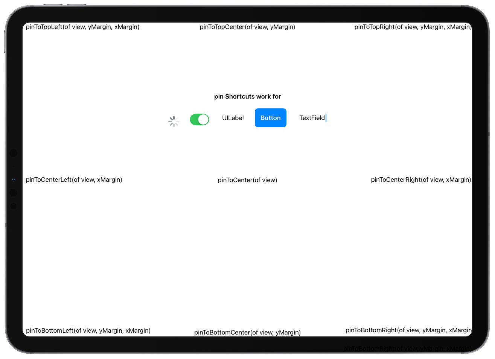

# 


Lambda Layout Kit (LK) is a library for dealing with auto layout in a simpler and modern way, using it you can configure your views layouts inside of closures or using shortcut methods, making your layout code cleaner and more readable.

## Requirements
- Swift 5.0 or later
- iOS 13 or later
- XCode 11 or later

## Instalation

LK uses Swift Package Manager as its distribution method, to use it you can fetch LK via XCode or adding it to your package.swift depencies list.

### Via XCode
1. In a Xcode project, click on "File"
2. Click on "Swift Packages" and select "Add Package Dependency"
3. Paste the web url for this repository: https://github.com/gbrlCM/LambdaLayoutKit.git
4. Set Rules to Branch on "main"

After this, you can fetch the latest changes to the framework  by selecting "Update to Latest Package Versions" in step 2.

### Via Package.swift
If you don't already have a `Package.swift` file, create one and add the following `.package` URL.
```swift
import PackageDescription

let package = Package(
    ...
    dependencies: [
        .package(url: "https://github.com/gbrlCM/LambdaLayoutKit.git", "1.1.2")
    ],
    ...
)
```


## Usage

There is two ways to use LK the first is with the layout method inside any UIView, with that you can configure any view constraints inside the configuration closure. The other way is with the shortcut methods for common constraint combinations like stretch the view to another view bounds or center one view inside another.

### Layout method:

```swift

import UIKit
import LambdaLayoutKit

class SomeViewController: UIViewController {

    ...
    @LKView childView: UIView
    ...

    overide func viewDidLoad() {
        ...
        
        childView.layout { anchors in
            anchors
                .top(attachTo: view.topAnchor)
                .leading(attachTo: view.leadingAnchor)
                .trailing(attachTo: view.trailingAnchor)
                .bottom(attachTo: view.bottomAnchor)
        }
        ...
    }
}
```
### Shortcuts:

Inside LK there is a few shortcut methods for common constraints, some are only available for views with intrinsic size other are available for all kinds of views you can see the relation in the examples bellow.

#### Pin shortcuts



#### Stretch shortcuts

***Using layout guides***
```swift
    childView.stretchToBounds(of: parentView.layoutMarginGuide)
```
***Using Views***
```swift
    childView.stretchToBounds(of: parentView)
```

## Goals

I made this library for learning Auto Layout and how to build libraries. I hope it helps you to write cleaner and clearer layout code.

## Next steps
- Make tests
- Make a proper doc using Jazzy
- Study the necessity of more shortcuts
